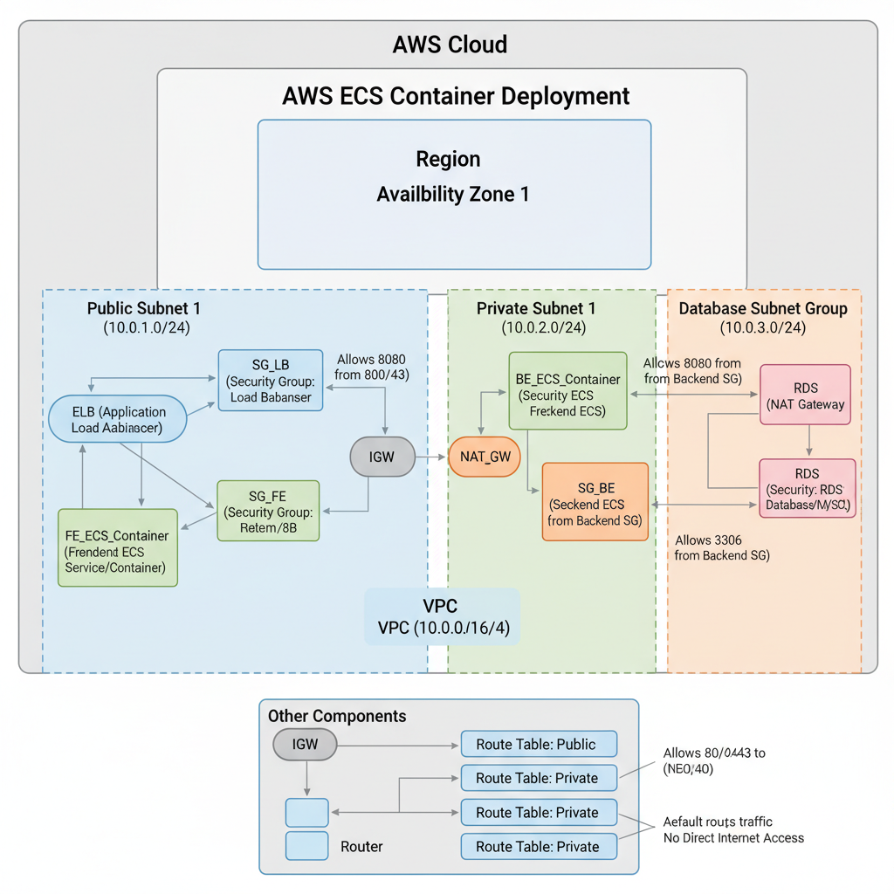
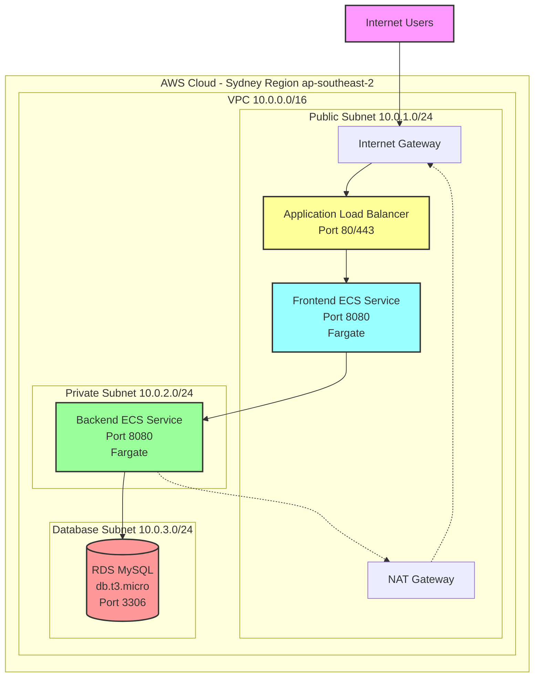
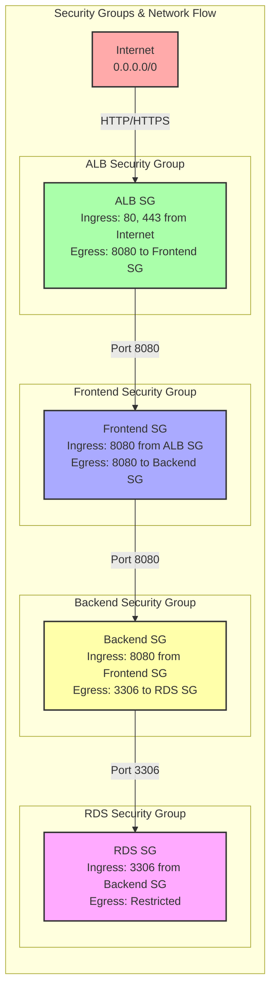
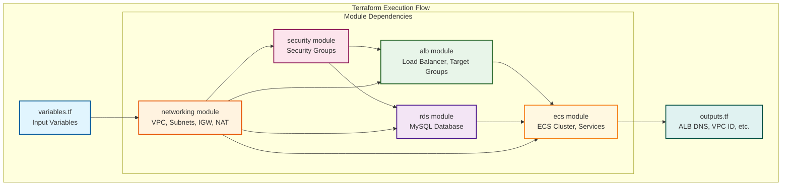

# AWS ECS Three-Tier Application Infrastructure

This Terraform project creates a complete three-tier application infrastructure on AWS using ECS Fargate, Application Load Balancer, and RDS MySQL.

## Architecture Diagram



## Architecture Flow Diagram



## Architecture Overview

The infrastructure consists of:

### Network Layer
- **VPC**: 10.0.0.0/16 CIDR block
- **Public Subnet**: 10.0.1.0/24 (for ALB and frontend)
- **Private Subnet**: 10.0.2.0/24 (for backend services)
- **Database Subnet**: 10.0.3.0/24 (for RDS)
- **Internet Gateway**: For public internet access
- **NAT Gateway**: For private subnet outbound access

### Security Groups
- **ALB Security Group**: Allows 80/443 from internet, egress to frontend
- **Frontend Security Group**: Allows 8080 from ALB, egress to backend
- **Backend Security Group**: Allows 8080 from frontend, egress to RDS
- **RDS Security Group**: Allows 3306 from backend only

### Compute Layer
- **ECS Cluster**: Fargate-based container orchestration
- **Frontend Service**: Public-facing web tier
- **Backend Service**: Private application tier
- **Application Load Balancer**: Routes traffic to frontend

### Database Layer
- **RDS MySQL**: db.t3.micro instance with automated backups
- **Multi-AZ subnet group**: For high availability

## Security Groups Flow Diagram



## Directory Structure

```
.
├── terraform-backend/         # Backend infrastructure setup
│   ├── main.tf               # S3 bucket and DynamoDB table
│   ├── variables.tf          # Backend configuration variables
│   ├── outputs.tf            # Backend resource outputs
│   ├── terraform.tfvars.example
│   └── README.md
├── terraform/                # Main infrastructure
│   ├── main.tf               # Main Terraform configuration
│   ├── variables.tf          # Input variables
│   ├── outputs.tf            # Output values
│   ├── terraform.tfvars.example
│   └── modules/
│       ├── networking/       # VPC, subnets, routing
│       ├── security/         # Security groups
│       ├── alb/              # Application Load Balancer
│       ├── ecs/              # ECS cluster and services
│       └── rds/              # RDS database
└── .github/
    └── workflows/            # CI/CD workflows
```

## Prerequisites

1. **AWS CLI configured** with appropriate credentials
2. **Terraform** installed (version >= 1.0)
3. **IAM permissions** for creating AWS resources

## Terraform Module Dependencies



## Deployment Instructions

### 1. Setup Backend Infrastructure (First Time Only)

Before deploying the main infrastructure, you need to create the S3 bucket and DynamoDB table for Terraform state management:

```bash
cd terraform-backend
cp terraform.tfvars.example terraform.tfvars
# Edit terraform.tfvars with your bucket name and settings
terraform init
terraform plan
terraform apply
```

**Note the outputs** - you'll need the bucket name for the next steps.

### 2. Clone and Setup Main Infrastructure

```bash
cd terraform
cp terraform.tfvars.example terraform.tfvars
```

### 3. Configure Variables

Edit `terraform.tfvars` with your specific values:

```hcl
# AWS Configuration
aws_region = "ap-southeast-2"

# Project Configuration
project_name = "your-project-name"
environment  = "dev"

# Network Configuration (customize if needed)
vpc_cidr             = "10.0.0.0/16"
availability_zone    = "ap-southeast-2a"
public_subnet_cidr   = "10.0.1.0/24"
private_subnet_cidr  = "10.0.2.0/24"
database_subnet_cidr = "10.0.3.0/24"

# Database Configuration
db_instance_class = "db.t3.micro"
db_name          = "appdb"
db_username      = "admin"
db_password      = "your-secure-password"
```

**Important**: Never commit `terraform.tfvars` to version control!

### 4. Initialize Terraform with Backend

```bash
# Initialize with S3 backend (replace with your bucket name from step 1)
terraform init \
  -backend-config="bucket=your-terraform-state-bucket" \
  -backend-config="key=terraform.tfstate" \
  -backend-config="region=ap-southeast-2" \
  -backend-config="dynamodb_table=terraform-state-locks" \
  -backend-config="encrypt=true"
```

### 5. Plan Deployment

```bash
terraform plan
```

Review the planned changes carefully.

### 6. Deploy Infrastructure

```bash
terraform apply
```

Type `yes` when prompted to confirm the deployment.

### 7. Get Outputs

After successful deployment, retrieve important information:

```bash
terraform output
```

Key outputs include:
- `alb_dns_name`: Load balancer URL for accessing your application
- `vpc_id`: VPC identifier
- `subnet_ids`: Network subnet identifiers
- `security_group_ids`: Security group identifiers

## Application Deployment

### Container Images

The infrastructure uses placeholder nginx images. Replace these in the ECS task definitions with your actual application images:

1. **Frontend**: Update `modules/ecs/main.tf` - line with `image = "nginx:latest"`
2. **Backend**: Update `modules/ecs/main.tf` - line with `image = "nginx:latest"`

### Environment Variables

Backend containers automatically receive database connection details:
- `DB_HOST`: RDS endpoint
- `DB_NAME`: Database name
- `DB_USER`: Database username
- `DB_PASSWORD`: Database password
- `PORT`: Application port (8080)

## Accessing Your Application

Once deployed, access your application using the ALB DNS name:

```bash
# Get the load balancer URL
terraform output alb_dns_name

# Access your application
curl http://<alb-dns-name>
```

## Customization

### Scaling

Modify desired count in `modules/ecs/main.tf`:

```hcl
resource "aws_ecs_service" "frontend" {
  desired_count = 2  # Scale to 2 instances
  # ...
}
```

### SSL/TLS

To enable HTTPS:

1. Obtain an SSL certificate via AWS Certificate Manager
2. Update the HTTPS listener in `modules/alb/main.tf`
3. Add certificate ARN to the listener configuration

### Multi-AZ Deployment

To deploy across multiple availability zones:

1. Add additional subnets in different AZs
2. Update ALB to use multiple subnets
3. Configure ECS services across multiple subnets

## Security Considerations

1. **Database Password**: Use AWS Secrets Manager for production
2. **Network ACLs**: Consider additional network-level security
3. **IAM Roles**: Follow principle of least privilege
4. **Encryption**: Enable encryption at rest for EBS volumes and RDS
5. **VPC Flow Logs**: Enable for network monitoring

## Monitoring and Logging

The infrastructure includes:

- **CloudWatch Logs**: ECS container logs
- **Container Insights**: ECS cluster monitoring
- **RDS Monitoring**: Database performance metrics

## Cleanup

To destroy all resources:

```bash
terraform destroy
```

**Warning**: This will delete all resources including the database!

## Troubleshooting

### Common Issues

1. **ECS Service Won't Start**
   - Check security groups allow required ports
   - Verify container images are accessible
   - Review CloudWatch logs for errors

2. **ALB Health Checks Failing**
   - Ensure application responds on `/health` endpoint
   - Verify security group rules allow ALB to backend communication

3. **Database Connection Issues**
   - Check security groups allow port 3306
   - Verify RDS is in the correct subnet group
   - Confirm database credentials

### Useful Commands

```bash
# Check ECS service status
aws ecs describe-services --cluster <cluster-name> --services <service-name>

# View container logs
aws logs tail /ecs/<project>-<environment>-frontend --follow

# Check ALB target health
aws elbv2 describe-target-health --target-group-arn <target-group-arn>
```

## Cost Optimization

For development environments:
- Use `db.t3.micro` for RDS (included in free tier)
- Set ECS desired count to 1
- Consider using Spot instances for non-critical workloads

## Support

For issues or questions:
1. Check AWS CloudWatch logs
2. Review Terraform state and plan output
3. Verify AWS CLI configuration and permissions

