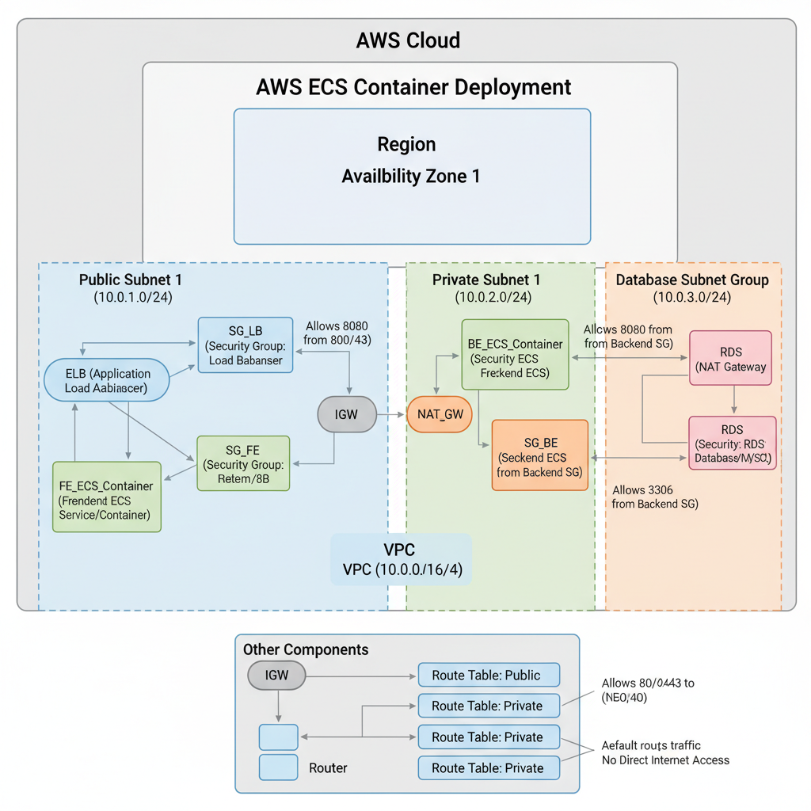
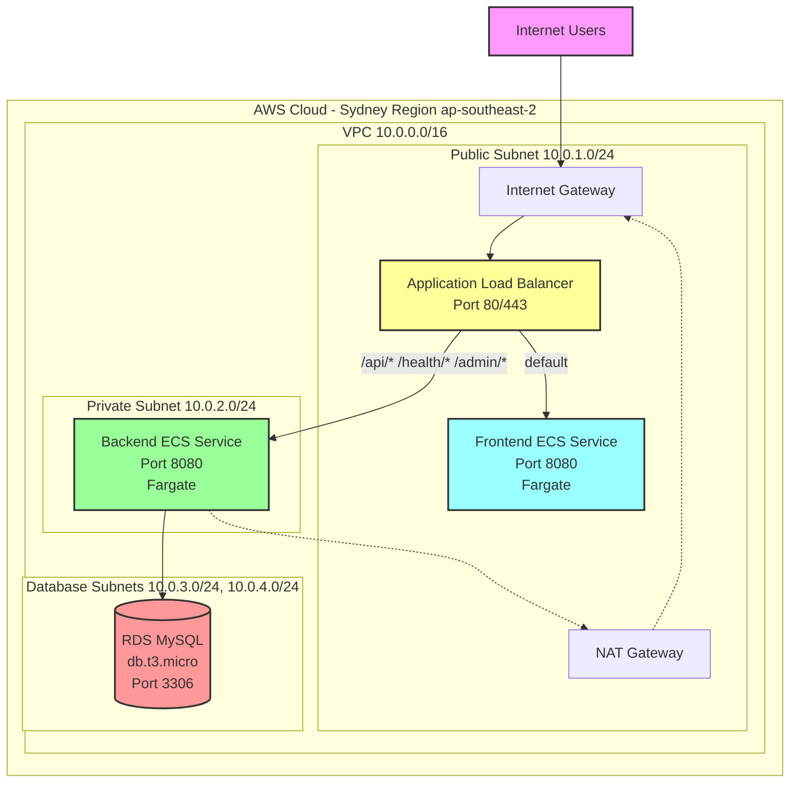
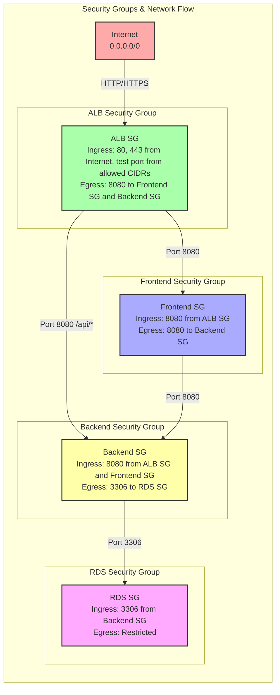
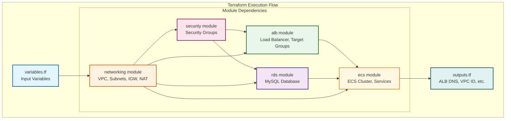

# AWS ECS Three-Tier Application Infrastructure

This Terraform project creates a complete three-tier application infrastructure on AWS using ECS Fargate, Application Load Balancer, and RDS MySQL.

## Architecture Diagram



## Architecture Flow Diagram


```mermaid
graph TB
    subgraph AWS["AWS Cloud - Sydney Region ap-southeast-2"]
        subgraph VPC["VPC 10.0.0.0/16"]
            subgraph PUB["Public Subnet 10.0.1.0/24"]
                IGW[Internet Gateway]
                ALB[Application Load Balancer<br/>Port 80/443]
                NAT[NAT Gateway]
                FE[Frontend ECS Service<br/>Port 8080<br/>Fargate]
            end

            subgraph PRIV["Private Subnet 10.0.2.0/24"]
                BE[Backend ECS Service<br/>Port 8080<br/>Fargate]
            end

            subgraph DB["Database Subnets 10.0.3.0/24, 10.0.4.0/24"]
                RDS[(RDS MySQL<br/>db.t3.micro<br/>Port 3306)]
            end
        end
    end

    Internet[Internet Users] --> IGW
    IGW --> ALB
    ALB -->|default| FE
    ALB -->|/api/* /health/* /admin/*| BE
    BE --> RDS
    BE -.-> NAT
    NAT -.-> IGW

    style Internet fill:#f9f,stroke:#333,stroke-width:2px
    style ALB fill:#ff9,stroke:#333,stroke-width:2px
    style FE fill:#9ff,stroke:#333,stroke-width:2px
    style BE fill:#9f9,stroke:#333,stroke-width:2px
    style RDS fill:#f99,stroke:#333,stroke-width:2px
```

## Architecture Overview

The infrastructure consists of:

### Network Layer
- **VPC**: 10.0.0.0/16 CIDR block
- **Public Subnet**: 10.0.1.0/24 (for ALB and frontend)
- **Private Subnet**: 10.0.2.0/24 (for backend services)
- **Database Subnets**: 10.0.3.0/24 and 10.0.4.0/24, one per availability zone (for RDS)
- **Internet Gateway**: For public internet access
- **NAT Gateway**: For private subnet outbound access

### Security Groups
- **ALB Security Group**: Allows 80/443 from internet and the test listener port only from `test_listener_cidr_blocks` (nobody by default), egress 8080 to frontend and backend
- **Frontend Security Group**: Allows 8080 from ALB, egress to backend
- **Backend Security Group**: Allows 8080 from ALB and frontend, egress to RDS
- **RDS Security Group**: Allows 3306 from backend only

### Compute Layer
- **ECS Cluster**: Fargate-based container orchestration
- **Frontend Service**: Public-facing web tier
- **Backend Service**: Private application tier, redeployed automatically when the database password rotates
- **Application Load Balancer**: Routes traffic to frontend

### Database Layer
- **RDS MySQL**: db.t3.micro instance on gp3 storage with automated backups, error and slow query logs exported to CloudWatch
- **Subnet group across two AZs**: Required by RDS; the instance itself is single-AZ unless `multi_az` is enabled

## Security Groups Flow Diagram


```mermaid
graph LR
    subgraph "Security Groups & Network Flow"
        Internet[Internet<br/>0.0.0.0/0]

        subgraph "ALB Security Group"
            ALB_SG[ALB SG<br/>Ingress: 80, 443 from Internet, test port from allowed CIDRs<br/>Egress: 8080 to Frontend SG and Backend SG]
        end

        subgraph "Frontend Security Group"
            FE_SG[Frontend SG<br/>Ingress: 8080 from ALB SG<br/>Egress: 8080 to Backend SG]
        end

        subgraph "Backend Security Group"
            BE_SG[Backend SG<br/>Ingress: 8080 from ALB SG and Frontend SG<br/>Egress: 3306 to RDS SG]
        end

        subgraph "RDS Security Group"
            RDS_SG[RDS SG<br/>Ingress: 3306 from Backend SG<br/>Egress: Restricted]
        end
    end

    Internet -->|HTTP/HTTPS| ALB_SG
    ALB_SG -->|Port 8080| FE_SG
    ALB_SG -->|Port 8080 /api/*| BE_SG
    FE_SG -->|Port 8080| BE_SG
    BE_SG -->|Port 3306| RDS_SG

    style Internet fill:#faa,stroke:#333,stroke-width:2px
    style ALB_SG fill:#afa,stroke:#333,stroke-width:2px
    style FE_SG fill:#aaf,stroke:#333,stroke-width:2px
    style BE_SG fill:#ffa,stroke:#333,stroke-width:2px
    style RDS_SG fill:#faf,stroke:#333,stroke-width:2px
```

## Directory Structure

```
.
├── terraform-backend/         # Backend infrastructure setup
│   ├── main.tf               # S3 bucket and DynamoDB table
│   ├── variables.tf          # Backend configuration variables
│   ├── outputs.tf            # Backend resource outputs
│   ├── terraform.tfvars.example
│   └── README.md
├── terraform/                # Main infrastructure
│   ├── main.tf               # Main Terraform configuration
│   ├── variables.tf          # Input variables
│   ├── outputs.tf            # Output values
│   ├── terraform.tfvars.example
│   ├── environments/         # Per-environment variable files applied by CI
│   └── modules/
│       ├── networking/       # VPC, subnets, routing
│       ├── security/         # Security groups
│       ├── alb/              # Application Load Balancer
│       ├── ecs/              # ECS cluster and services
│       ├── rds/              # RDS database
│       └── monitoring/       # CloudWatch alarms and SNS topic
└── .github/
    └── workflows/            # CI/CD workflows
```

## Prerequisites

1. **AWS CLI configured** with appropriate credentials
2. **Terraform** installed (version >= 1.4)
3. **IAM permissions** for creating AWS resources

## Terraform Module Dependencies


```mermaid
graph TD
    subgraph "Terraform Execution Flow"
        Variables[variables.tf<br/>Input Variables]

        subgraph "Module Dependencies"
            Network[networking module<br/>VPC, Subnets, IGW, NAT]
            Security[security module<br/>Security Groups]
            ALB_mod[alb module<br/>Load Balancer, Target Groups]
            RDS_mod[rds module<br/>MySQL Database]
            ECS[ecs module<br/>ECS Cluster, Services]
        end

        Outputs[outputs.tf<br/>ALB DNS, VPC ID, etc.]
    end

    Variables --> Network
    Network --> Security
    Security --> ALB_mod
    Security --> RDS_mod
    ALB_mod --> ECS
    RDS_mod --> ECS
    Network --> ALB_mod
    Network --> RDS_mod
    Network --> ECS
    ECS --> Outputs

    style Variables fill:#e1f5fe,stroke:#01579b,stroke-width:2px
    style Network fill:#fff3e0,stroke:#e65100,stroke-width:2px
    style Security fill:#fce4ec,stroke:#880e4f,stroke-width:2px
    style ALB_mod fill:#e8f5e9,stroke:#1b5e20,stroke-width:2px
    style RDS_mod fill:#f3e5f5,stroke:#4a148c,stroke-width:2px
    style ECS fill:#fff8e1,stroke:#f57f17,stroke-width:2px
    style Outputs fill:#e0f2f1,stroke:#004d40,stroke-width:2px
```

## Deployment Instructions

### 1. Setup Backend Infrastructure (First Time Only)

Before deploying the main infrastructure, you need to create the S3 bucket and DynamoDB table for Terraform state management:

```bash
cd terraform-backend
cp terraform.tfvars.example terraform.tfvars
# Edit terraform.tfvars with your bucket name and settings
terraform init
terraform plan
terraform apply
```

**Note the outputs** - you'll need the bucket name for the next steps.

### 2. Clone and Setup Main Infrastructure

```bash
cd terraform
cp terraform.tfvars.example terraform.tfvars
```

### 3. Configure Variables

The committed files under `terraform/environments/` hold the sizing for each environment and are what the workflows apply; you can use one locally with `terraform plan -var-file=environments/dev.tfvars`. For account-specific values, edit `terraform.tfvars`:

```hcl
# AWS Configuration
aws_region = "ap-southeast-2"

# Project Configuration
project_name = "your-project-name"
environment  = "dev"

# Network Configuration (customize if needed)
# Public, private and database subnets are created one per availability zone,
# matched to availability_zones by index. ALB and RDS require at least two.
vpc_cidr              = "10.0.0.0/16"
availability_zones    = ["ap-southeast-2a", "ap-southeast-2b"]
public_subnet_cidrs   = ["10.0.1.0/24", "10.0.11.0/24"]
private_subnet_cidrs  = ["10.0.2.0/24", "10.0.12.0/24"]
database_subnet_cidrs = ["10.0.3.0/24", "10.0.4.0/24"]

# Database Configuration
# RDS generates the master password and stores it in Secrets Manager.
db_instance_class = "db.t3.micro"
db_name           = "appdb"
db_username       = "admin"

# Optional: enable HTTPS on the ALB with an ACM certificate
# certificate_arn = "arn:aws:acm:ap-southeast-2:123456789012:certificate/..."
```

**Important**: Never commit `terraform.tfvars` to version control!

### 4. Initialize Terraform with Backend

```bash
# Initialize with S3 backend (replace with your bucket name from step 1)
terraform init \
  -backend-config="bucket=your-terraform-state-bucket" \
  -backend-config="key=terraform.tfstate" \
  -backend-config="region=ap-southeast-2" \
  -backend-config="dynamodb_table=terraform-state-locks" \
  -backend-config="encrypt=true"
```

### 5. Plan Deployment

```bash
terraform plan
```

Review the planned changes carefully.

### 6. Deploy Infrastructure

```bash
terraform apply
```

Type `yes` when prompted to confirm the deployment.

### 7. Get Outputs

After successful deployment, retrieve important information:

```bash
terraform output
```

Key outputs include:
- `alb_dns_name`: Load balancer URL for accessing your application
- `vpc_id`: VPC identifier
- `subnet_ids`: Network subnet identifiers
- `security_group_ids`: Security group identifiers

## Application Deployment

### Container Images

The task definitions default to `hashicorp/http-echo`, a tiny server that answers 200 on every path on port 8080, so a fresh apply passes health checks before any application image exists. You have two options for deploying real images:

#### **Option 1: Automated CI/CD (Recommended)**
Use the [CI/CD pipeline](https://github.com/sabiut/aws-ecs-cicd-pipeline) for automated deployment:
- Automatically builds and pushes Docker images to ECR
- Updates ECS services with new images
- Includes health checks and rollback capabilities
- No manual image updates required

#### **Option 2: Pin images in Terraform**
Set the image variables in `terraform.tfvars` and clear the placeholder commands so each image's own entrypoint runs:

```hcl
frontend_image   = "123456789012.dkr.ecr.ap-southeast-2.amazonaws.com/frontend:v1"
frontend_command = []
backend_image    = "123456789012.dkr.ecr.ap-southeast-2.amazonaws.com/backend:v1"
backend_command  = []
```

Images must listen on port 8080 and answer the health check paths (`frontend_health_check_path`, default `/api/health`; `backend_health_check_path`, default `/health/`).

### Environment Variables

Backend containers automatically receive database connection details:
- `DB_HOST`: RDS endpoint
- `DB_NAME`: Database name
- `DB_USER`: Database username
- `DB_PASSWORD`: Database password
- `PORT`: Application port (8080)

`DB_USER` and `DB_PASSWORD` are read from Secrets Manager when a task starts. RDS rotates the password every seven days, so the infrastructure redeploys the backend services whenever the secret's active version changes (see [Database password rotation](#database-password-rotation)).

## Accessing Your Application

Once deployed, access your application using the ALB DNS name:

```bash
# Get the load balancer URL
terraform output alb_dns_name

# Access your application
curl http://<alb-dns-name>
```

## Customization

### Sizing and Production Settings

Task size, task count, log retention and database topology are variables with development defaults. A production `terraform.tfvars` looks like:

```hcl
environment            = "prod"

frontend_cpu           = 512
frontend_memory        = 1024
frontend_desired_count = 2
backend_cpu            = 512
backend_memory         = 1024
backend_desired_count  = 2
log_retention_days     = 90

db_instance_class      = "db.t3.small"
db_multi_az            = true

certificate_arn        = "arn:aws:acm:ap-southeast-2:123456789012:certificate/..."
alarm_email            = "ops@example.com"
test_listener_cidr_blocks = ["203.0.113.0/24"]
```

These are the values in `terraform/environments/prod.tfvars`, which the apply workflow uses for the prod workspace; `dev.tfvars` and `staging.tfvars` cover the other two. Setting `environment = "prod"` also turns on RDS deletion protection and a final snapshot. The desired counts are the initial values for the active colour; the deployment pipeline owns them afterwards. Fargate accepts only certain CPU and memory pairings, so check the [task size table](https://docs.aws.amazon.com/AmazonECS/latest/developerguide/task-cpu-memory-error.html) when changing them.

### SSL/TLS

To enable HTTPS:

1. Request or import a certificate in AWS Certificate Manager (same region as the ALB)
2. Set `certificate_arn` in `terraform.tfvars` to the certificate's ARN
3. Run `terraform apply`

The HTTPS listener is only created when `certificate_arn` is set. Without it the ALB serves the application on HTTP. With it, port 80 only redirects to HTTPS with a 301, the backend rule on port 80 is not created, and `http_listener_arn` and `backend_listener_rule_arn` are null, so the pipeline only switches the HTTPS and test listeners.

Turning HTTPS on or off replaces the port-80 listener (AWS allows one listener per port, so it cannot be swapped in place). Port 80 is unavailable for a few seconds during the apply, and the new listener starts out pointing at blue, so switch HTTPS on at a time when blue is the live colour or switch back afterwards. A deployment created before this listener was unified, that already had a certificate, must move its redirect listener in state before applying:

```bash
terraform state mv 'module.alb.aws_lb_listener.http_redirect[0]' module.alb.aws_lb_listener.http
```

### Multi-AZ Deployment

Public, private and database subnets are each created one per entry in `availability_zones`, two by default. Frontend tasks are spread across the public subnets and backend tasks across the private subnets, so losing one AZ leaves the other serving. The database runs in a single AZ unless `db_multi_az = true`, which adds a synchronous standby in the second AZ and roughly doubles the instance cost.

The one single-AZ component is the NAT gateway in the first public subnet. If that AZ fails, backend tasks in the other AZ lose outbound internet access (image pulls, external APIs) until it recovers. A NAT gateway per AZ removes that dependency at about double the NAT cost.

## Security Considerations

1. **Database Password**: Generated by RDS and stored in Secrets Manager; it never passes through Terraform variables or state. RDS rotates it every seven days, and it can be rotated on demand from the RDS console or with `aws rds modify-db-instance --rotate-master-user-password --apply-immediately`. See [Database password rotation](#database-password-rotation) for how running tasks pick up the new password
2. **Test listener**: Fronts the inactive colour, which may be running an unreleased build. It is closed until `test_listener_cidr_blocks` lists the office or CI ranges that may reach it
3. **Network ACLs**: Consider additional network-level security
4. **IAM Roles**: Follow principle of least privilege
5. **Encryption**: RDS storage is encrypted at rest with the default KMS key; the Secrets Manager secret is encrypted with the Secrets Manager default key
6. **Production safeguards**: When `environment` is `prod`, RDS deletion protection is on and a final snapshot is taken on destroy
7. **VPC Flow Logs**: Enable for network monitoring

### Database password rotation

ECS reads `DB_USER` and `DB_PASSWORD` from Secrets Manager only when a task starts, so on its own a rotation would leave running backend tasks with a password that no longer works. Secrets Manager publishes a `Secret Label Updated` event whenever the secret's `AWSCURRENT` label moves to a new version, which is what a rotation does. An EventBridge rule matches that event for the database secret and starts a small Step Functions state machine that forces a new deployment of both backend services and waits for each rollout to finish. ECS starts tasks with the new password before stopping the old ones; the inactive colour has no tasks, so nothing happens there. The state machine only succeeds once a service has a single deployment reporting `COMPLETED`, meaning every task started before the rotation is gone. It fails if ECS rolls the deployment back, and times out if the rollout has not settled within an hour.

Between RDS changing the password and the new tasks becoming healthy, typically a few minutes, new database connections from the old tasks fail. Existing connections are unaffected. An application that must not see that window should retry with a fresh read of the secret on authentication failure instead of relying on the injected variable. If the redeploy fails or times out, the `db-secret-redeploy-failed` alarm fires.

## Monitoring and Logging

The infrastructure includes:

- **CloudWatch Logs**: ECS container logs, retention set by `log_retention_days`
- **Container Insights**: ECS cluster monitoring
- **Deployment circuit breaker**: Each ECS service stops a rollout whose tasks keep failing and rolls back to the last healthy task definition
- **RDS Monitoring**: Database performance metrics

### Alarms

The `monitoring` module creates CloudWatch alarms for the conditions that need a person:

| Alarm | Condition |
|---|---|
| `<project>-<env>-<tier>-<colour>-unhealthy-targets` | Any target failing ALB health checks for 3 minutes, one alarm per target group |
| `<project>-<env>-alb-5xx` | More than 10 ALB-generated 5xx in 5 minutes (no healthy targets, timeouts) |
| `<project>-<env>-target-5xx` | More than 25 application 5xx in 5 minutes |
| `<project>-<env>-rds-cpu` | Database CPU above 80% for 15 minutes |
| `<project>-<env>-rds-free-storage` | Free storage below 2 GiB |
| `<project>-<env>-rds-freeable-memory` | Freeable memory below 256 MiB for 15 minutes |
| `<project>-<env>-db-secret-redeploy-failed` | The backend redeploy after a database password rotation was rolled back or did not finish within an hour; tasks may hold a stale password |

Alarms always exist and are visible in the CloudWatch console. To be notified, set `alarm_email`, which creates an SNS topic and an email subscription that must be confirmed from the email AWS sends, or pass existing topic ARNs in `alarm_actions`. Thresholds are module variables if the defaults do not fit.

## Cleanup

To destroy all resources:

```bash
terraform destroy
```

**Warning**: This will delete all resources including the database!

When `environment` is `prod`, the RDS instance has deletion protection enabled and takes a final snapshot named `<project>-prod-rds-final` on destroy. To destroy prod you must first apply with `environment` set to something else or clear the protection manually, and delete any earlier snapshot of that name. The destroy workflow deliberately does not offer prod.

## Troubleshooting

### Common Issues

1. **ECS Service Won't Start**
   - Check security groups allow required ports
   - Verify container images are accessible
   - Review CloudWatch logs for errors

2. **ALB Health Checks Failing**
   - Ensure application responds on `/health` endpoint
   - Verify security group rules allow ALB to backend communication

3. **Database Connection Issues**
   - Check security groups allow port 3306
   - Verify RDS is in the correct subnet group
   - Confirm database credentials

### Useful Commands

```bash
# Check ECS service status
aws ecs describe-services --cluster <cluster-name> --services <service-name>

# View container logs
aws logs tail /ecs/<project>-<environment>-frontend --follow

# Check ALB target health
aws elbv2 describe-target-health --target-group-arn <target-group-arn>
```

## CI/CD Integration

This infrastructure is designed to work with automated CI/CD pipelines for application deployment:

### **CI/CD Repository**
- **Repository**: [aws-ecs-cicd-pipeline](https://github.com/sabiut/aws-ecs-cicd-pipeline)
- **Purpose**: Provides GitHub Actions workflows and Terraform modules for automated deployment
- **Features**: ECR repositories, IAM OIDC authentication, automated deployments with rollback

### **Application Repositories**
- **Django Backend**: [aws-ecs-backend-django](https://github.com/sabiut/aws-ecs-backend-django)
- **Next.js Frontend**: [aws-ecs-frontend-react](https://github.com/sabiut/aws-ecs-frontend-react)

### **ECS Services Created**
After deploying this infrastructure, the following ECS resources will be available for CI/CD:

```bash
# ECS Cluster
ecs-three-tier-dev-cluster

# ECS Services, one pair per tier. Blue is live after the first apply.
ecs-three-tier-dev-frontend-blue   # Next.js application
ecs-three-tier-dev-frontend-green
ecs-three-tier-dev-backend-blue    # Django API
ecs-three-tier-dev-backend-green
```

The service names, target group ARNs, and listener ARNs are exported as Terraform outputs (`frontend_service_names`, `backend_target_group_arns`, `http_listener_arn`, and so on) so the pipeline does not have to hardcode them.

### **Blue/Green Switching**

Each tier has a blue and a green ECS service, each registered with its own target group. The ALB's production listeners (HTTP, and HTTPS when a certificate is configured) select the live colour: the default action picks the frontend, and the `/api/*`, `/health/*`, `/admin/*` rule picks the backend. A **test listener** on `test_listener_port` (default 9000) fronts the inactive colour the same way. It exists so the inactive target groups are attached to the load balancer, which ECS requires before it creates the services and which the ALB requires before it health checks them, and so a release can be exercised at `test_url` before any production traffic moves. The inactive colour may be running an unreleased build, so the test port is only open to `test_listener_cidr_blocks`; set it to the office or CI egress ranges that run the smoke test, or leave it empty to keep the port closed. A deployment:

1. Registers a new task definition revision and points the **inactive** colour's service at it, scaling it to the desired count.
2. Waits for the inactive target group to report healthy targets, then smoke tests through `terraform output -raw test_url`.
3. Swaps the production and test listeners: every production listener (HTTP and HTTPS) and its backend rule move to the new colour, and the test listener and its rule move to the old colour. Switch HTTP and HTTPS in the same step or traffic splits between colours.
4. Scales the previously active colour to zero, or leaves it running behind the test listener for a fast rollback.

```bash
# Example: switch frontend traffic to green
aws elbv2 modify-listener \
  --listener-arn "$(terraform output -raw http_listener_arn)" \
  --default-actions Type=forward,TargetGroupArn="$(terraform output -json frontend_target_group_arns | jq -r .green)"

# Example: switch backend traffic to green
aws elbv2 modify-rule \
  --rule-arn "$(terraform output -raw backend_listener_rule_arn)" \
  --actions Type=forward,TargetGroupArn="$(terraform output -json backend_target_group_arns | jq -r .green)"
```

Terraform sets the initial state (blue live, green at zero behind the test listener) and then ignores changes to listener actions, service task definitions, and desired counts, so a later `terraform apply` does not undo a switch made by the pipeline. If the listener or a service is ever recreated by Terraform, it comes back pointing at blue; check which colour is live before applying a change that replaces those resources.

### **Next Steps for CI/CD**
1. **Deploy this infrastructure first** (you're here)
2. **Deploy CI/CD infrastructure** using the repository above
3. **Configure GitHub secrets** for application repositories
4. **Push to application repositories** to trigger automated deployments

### **Container Image Updates**
The infrastructure uses placeholder nginx images. The CI/CD pipeline will:
- Build application-specific Docker images
- Push to ECR repositories
- Update ECS services with new images
- Perform health checks and rollback if needed

## Related Repositories

This infrastructure works with the following repositories:

- **ECS Infrastructure**: [terraform-aws-ecs-infra](https://github.com/sabiut/terraform-aws-ecs-infra) (this repository)
- **CI/CD Pipeline**: [aws-ecs-cicd-pipeline](https://github.com/sabiut/aws-ecs-cicd-pipeline)
- **Django Backend**: [aws-ecs-backend-django](https://github.com/sabiut/aws-ecs-backend-django)
- **Next.js Frontend**: [aws-ecs-frontend-react](https://github.com/sabiut/aws-ecs-frontend-react)

## Cost Optimization

For development environments the defaults already apply: `db.t3.micro`, single-AZ database, one task per active colour, 256 CPU / 512 MiB tasks, 7 day log retention. The main fixed costs are the NAT gateway and the ALB, which run regardless of load. Destroy environments you are not using.

## Support

For issues or questions:
1. Check AWS CloudWatch logs
2. Review Terraform state and plan output
3. Verify AWS CLI configuration and permissions

